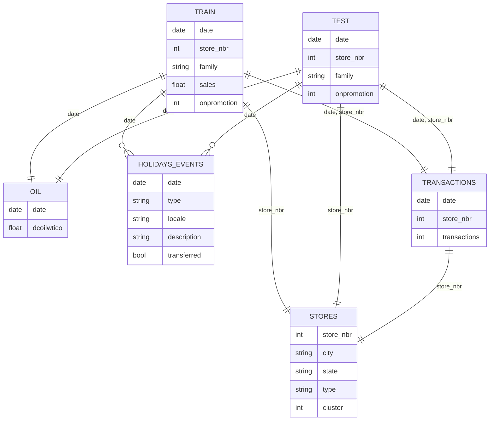
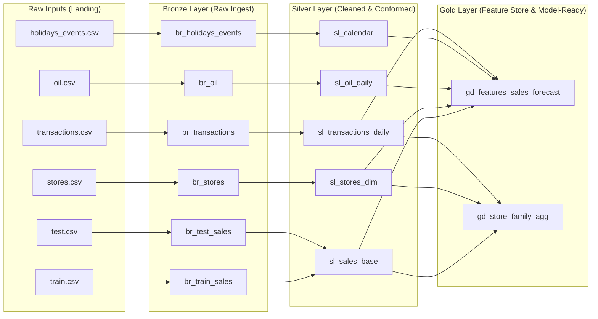

# DE Final Project - Retail Demand Forecasting
**CSCI E-103: Data Engineering for Analytics to Solve Business Challenges**
## Project Overview

This project implements a production-style data engineering workflow for forecasting daily retail demand across Favorita grocery stores in Ecuador.

## Dataset Documentation

This project uses multiple real-world datasets from Favorita, a large grocery retailer in Ecuador.  
All datasets are stored as CSV files and combined to form a complete analytical pipeline for retail demand forecasting.

### 1. `train.csv` — Core Sales Fact Table

Daily historical sales at the granularity of **store × product family × date**.

### Columns
| Column        | Type  | Description |
|---------------|--------|-------------|
| `date`        | date   | Daily timestamp |
| `store_nbr`   | int    | Store identifier |
| `family`      | string | Product family/category |
| `sales`       | float  | Units sold (fractional possible) |
| `onpromotion` | int    | Number of items on promotion |

### Notes for Data Engineering
- Primary fact table for all downstream modeling.
- Used for constructing lag features, rolling windows, and seasonality patterns.
- Requires handling of zero-sales days and ensuring time continuity across stores and families.

---

### 2. `test.csv` — Future Observation Window

Contains the **15 days immediately following** the last date in `train.csv`.  
Schema is identical to `train.csv`, except the column "sales" is not present in test.

### Notes for Data Engineering
- Used to validate pipeline reproducibility across unseen dates.
- Must undergo identical preprocessing and feature engineering steps as the training data.

---

### 3. `stores.csv` — Store Metadata

Static attributes describing each store location.

### Columns
| Column      | Description |
|-------------|-------------|
| `store_nbr` | Primary key used to join with sales data |
| `city`      | City where the store is located |
| `state`     | State/province |
| `type`      | Store type/format |
| `cluster`   | Grouping of similar stores based on demographics and performance |

### Notes for Data Engineering
- Joined as a dimension table.
- Enables geographic features, regional segmentation, and hierarchical modeling.

---

### 4. `oil.csv` — Daily Oil Prices

Daily oil price index relevant to Ecuador's economy.

### Columns
| Column       | Description |
|--------------|-------------|
| `date`       | Daily timestamp |
| `dcoilwtico` | Oil price value |

### Notes for Data Engineering
- Contains missing values → requires forward-fill imputation.
- Acts as an external regressor for long-term economic trend modeling.

---

### 5. `holidays_events.csv` — Holiday & Event Calendar

Complex metadata describing official holidays, transferred holidays, bridge days, additional holidays, and workdays.

### Columns
| Column       | Description |
|--------------|-------------|
| `date`       | Calendar date |
| `type`       | Holiday, Transfer, Bridge, Additional, Event, Work Day |
| `locale`     | National, Regional, Local |
| `description`| Holiday/event name |
| `transferred`| Boolean flag indicating if the holiday was officially moved |

### Notes for Data Engineering
- Requires careful normalization:
  - **Transferred holidays:** official date ≠ observed date.
  - **Bridge days:** added to extend weekends/holiday periods.
  - **Work days:** normally off-days added to compensate for bridges.
  - **Additional holidays:** extra days added around major events.
- Must be aggregated into a single, clean holiday indicator per date.

---
### 6. `transactions.csv` — Daily Store-Level Foot Traffic

This file contains the number of customer transactions recorded per store per day.

### Columns
| Column         | Type  | Description |
|----------------|-------|-------------|
| `date`         | date  | Daily timestamp |
| `store_nbr`    | int   | Store identifier |
| `transactions` | int   | Number of customer transactions in that store on that date |

### Notes for Data Engineering
- Represents **store-level demand signal** independent of product mix.
- Useful for:
  - Correlating store traffic with sales volume  
  - Building features such as transaction rolling averages  
  - Detecting anomalies or sudden traffic increases  
- Joins naturally with the sales fact table via (`date`, `store_nbr`).

---

### Additional Contextual Factors

These factors are not separate files but are essential for feature engineering and modeling:

#### 1. Public-Sector Pay Cycles
- Wages paid **twice monthly** (15th and last day).  
- Often cause noticeable sales spikes.

#### 2. 2016 Earthquake Impact
- A **7.8 magnitude earthquake on April 16, 2016** caused abnormal spikes in essential goods.  
- Should be tagged as special events/outliers.

---
### ERD

---
### Data Pipeline (Medallion Architecture) proposal

